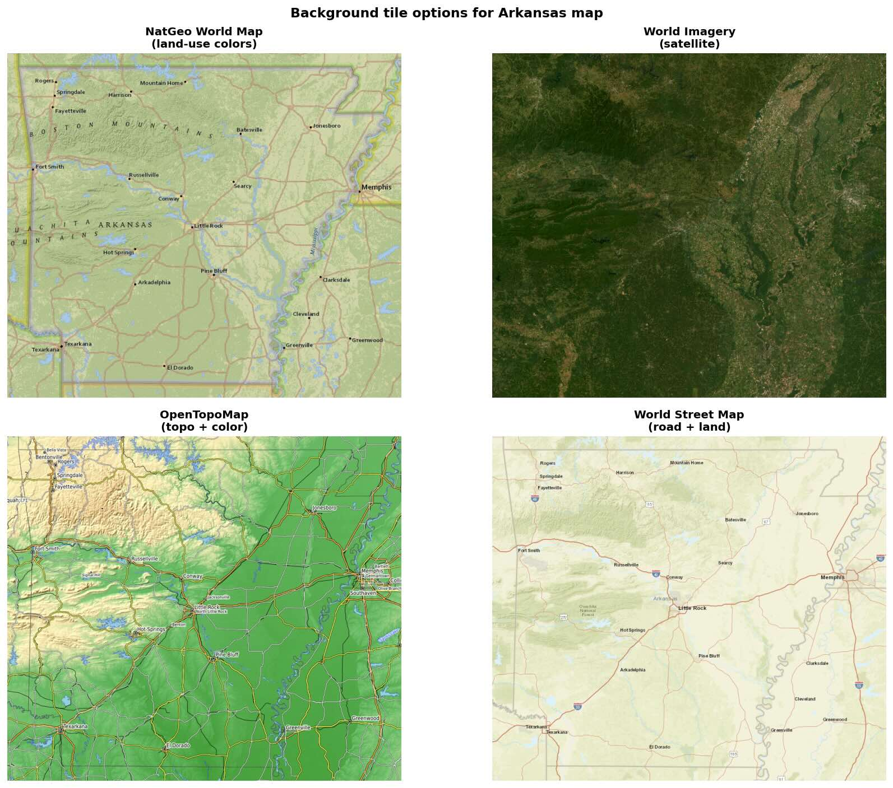
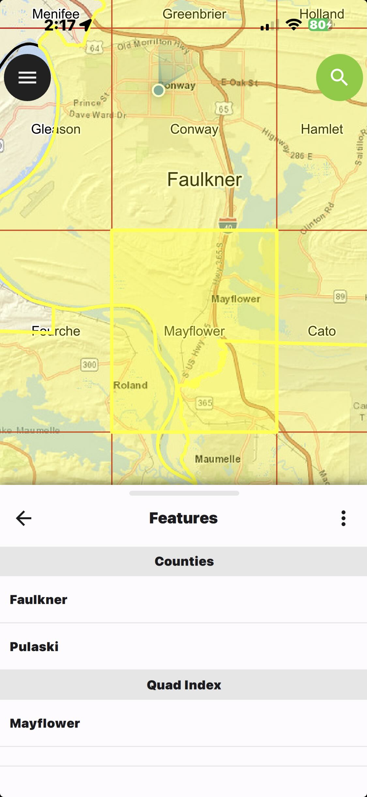

# ArkansasMaps
## A repository of free, open-source Arkansas map data in GeoTIFF format, designed to quickly find the map name for the USGS 7.5 minute topo map at your current location.

These custom georeferenced maps are especially useful for hiking and canoeing in the Ozark and Ouachita National Forests because they work without access to wireless data.  You can store them on your smartphone and use them anywhere in the State of Arkansas with the appropriate software.  These maps work with the GPS coordinates on your phone to automatically show your location and identify the county name and USGS topographical map name for your current location.

This repository contains two kinds of georeferenced maps:
1) Maps in standard GeoTIFF format which can be imported into several software applications, typically about 4 MB per map, and
2) High-resolution maps intended specifically for use with the QField app on iOS or Android devices, uses about 180 MB for a bundle of four maps.

Click on the "Releases" link on Github project page to access the free downloads for the maps - https://github.com/dsward2/ArkansasMaps/releases

---

### Arkansas County Maps with USGS 7.5-Minute Topo Quad Index in GeoTIFF format

**Arkansas_Topo_Index_grid_with_highways.tif** is a georeferenced map of Arkansas showing all 75 county boundaries overlaid with the complete index grid for USGS 7.5-minute topographic maps. Each grid cell is labeled with its official quad name — there are 874 of them covering the state. The background is ESRI's World Topo layer showing shaded relief, roads, and contours.

The map is a GeoTIFF (EPSG:3857) built from official data sources: Census TIGER for county boundaries and the USGS National Map Indices geodatabase for the quad grid. It's designed to load in QField on a phone so you can see your GPS location relative to which topo quad you're standing in — handy for hiking, hunting, or any fieldwork where you're cross-referencing paper topo maps.

This screenshot shows the map displayed in QField.app on an iPhone.  The user's location is marked on the map, based on the live GPS coordinates of the iPhone's current locaton.  The grid for that location shows that the USGS 7.5 minute topographical map is named "Conway".

**Arkansas_Topo_Index_simple_grid.tif** is a similar map, but without the raster map of highways in the background.

---

### Hi-Res Maps for QField.app on iPhone or Android

**Arkansas_QField_USGS_Topo_Finder.zip** - This bundle of four maps for the QField mobile app provides a variety of high-resolution raster backgrounds that are helpful for finding topo maps - even when wireless data service is not available.  

[QField.app](https://qfield.org) is a free, [open-source](https://github.com/opengisch/QField) app for iPhone, Android and other devices.  It is a mobile companion app to the popular QGIS sytstem, and it is capable of managing many topo maps on your smartphone without extra fees or limitations on the number of maps you can use.  QField is available for installation at your favorite app store.

The background images are previewed below:

This screenshot shows how QField allows selection of index cells and counties, which are identified in a result table on screen.  The user has tapped on the index grid to select the map named "Mayflower".

