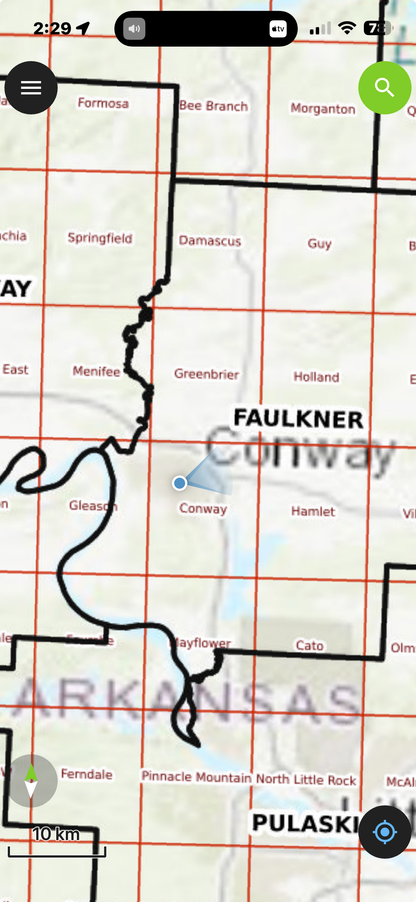

# ArkansasMaps
A repository of Arkansas map data in GeoTIFF format.

Arkansas County Map with USGS 7.5-Minute Topo Quad Index

Arkansas_Topo_Index_grid_with_highways.tif is a georeferenced map of Arkansas showing all 75 county boundaries overlaid with the complete index grid for USGS 7.5-minute topographic maps. Each grid cell is labeled with its official quad name — there are 874 of them covering the state. The background is ESRI's World Topo layer showing shaded relief, roads, and contours.

The map is a GeoTIFF (EPSG:3857) built from official data sources: Census TIGER for county boundaries and the USGS National Map Indices geodatabase for the quad grid. It's designed to load in QField on a phone so you can see your GPS location relative to which topo quad you're standing in — handy for hiking, hunting, or any fieldwork where you're cross-referencing paper topo maps.

Arkansas_Topo_Index_simple_grid.tif is a similar map, but without the raster map of highways in the background.

This screenshot shows the map displayed in [QField.app](https://github.com/opengisch/QField) on an iPhone.  The user's location is marked on the map, based on the live GPS coordinates of the iPhone's current locaton.  The grid for that location shows that the USGS 7.5 minute topological map is named "Conway".

